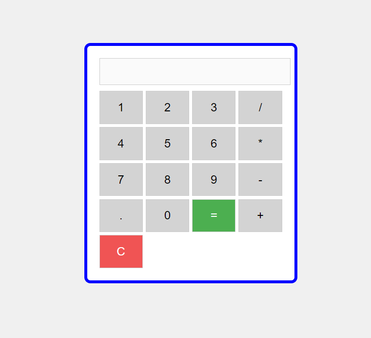

# Simple Calculator

This is a basic calculator built using **HTML**, **CSS**, and **JavaScript**. The calculator supports the following basic arithmetic operations:

- Addition
- Subtraction
- Multiplication
- Division

## Features

- Clean and simple user interface.
- Basic operations like addition, subtraction, multiplication, and division.
- Real-time calculation display.
- Reset button to clear all inputs.

## Live Demo

[Live Demo](#) - You can deploy this on GitHub Pages or another hosting service and add the link here.

## Screenshots

  
*Screenshot of the calculator UI* (You can add a screenshot of the calculator interface here)

## Installation and Usage

1. Clone the repository:
    ```bash
    git clone https://github.com/Christy2001/CodeAlpha_Calculator.git
    ```
2. Navigate to the project directory:
    ```bash
    cd CodeAlpha_Calculator
    ```
3. Open the `index.html` file in your web browser to run the calculator:
    ```bash
    open index.html
    ```
